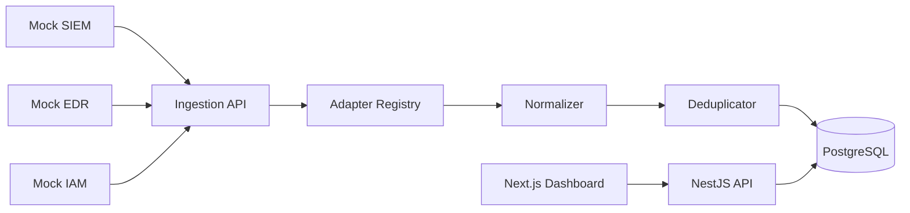

# SentinelView
## Security Event Monitoring Dashboard

SentinelView is a full-stack portfolio application that normalizes fictional SIEM, EDR, and IAM event payloads into a common security-event model for analyst review.

SentinelView is an educational portfolio project. All sources, payloads, detections, users, assets, and incidents are fictional. It is not a production SIEM, EDR, IAM, SOC, or threat-detection platform.

The repository does not reproduce proprietary employer integrations or commercial security-product schemas.

## Overview

The app demonstrates how source-specific telemetry can be validated, adapted, deduplicated, stored, and reviewed through a compact analyst workflow. It uses intentionally small fictional payloads so the architecture is visible without depending on real security products.

## What This Demonstrates

- Adapter pattern and source-specific validation
- Event normalization into one internal model
- API-key protected ingestion
- Idempotent ingestion and duplicate merging
- JWT authentication and role-based authorization
- Analyst status, assignment, notes, and history workflows
- PostgreSQL entities, JSONB payload storage, indexes, constraints, and migrations
- Dashboard aggregation APIs and a Next.js operations UI
- Docker Compose deployment shape for web, API, and PostgreSQL

## Disclaimer

All detections, assets, users, IP addresses, and events are demo data. The application is for education and portfolio review only.

## Features

- Three fictional sources: `MOCK_SIEM`, `MOCK_EDR`, `MOCK_IAM`
- Normalized severity, category, source, asset, user, IP, and timing fields
- Unique event identity by `sourceType + sourceEventId`
- Duplicate events increment `occurrenceCount` and write history
- Read-only viewer role and mutation-capable analyst/admin roles
- Dashboard summary cards, severity chart, timeline, recent events table
- Event list with search, filters, sorting, and pagination
- Event detail with raw JSON text, notes, history, status, and assignment
- Source activity state derived from recent ingestion

## Architecture



## Event Sources

`MOCK_SIEM` models rule-based log events. `MOCK_EDR` models endpoint detections. `MOCK_IAM` models identity risk activity. These schemas are original fictional inputs, not vendor schemas.

## Normalization

Adapters live in `apps/api/src/ingestion/adapters`. Each adapter validates an unknown payload and converts it into `NormalizedEventInput`. Controllers do not contain normalization rules.

## Deduplication

A database unique constraint enforces `sourceType + sourceEventId`. The ingestion service first locks existing rows when present. If two first-time inserts race, the unique violation is caught and the existing row is merged in the same transactional flow.

## Analyst Workflow

Users can list events, open details, change valid statuses, assign analyst/admin users, and add notes. Every meaningful change writes an application history record. This history is not a tamper-evident audit system.

## Tech Stack

Frontend: Next.js, React, TypeScript, Tailwind CSS, TanStack Query, React Hook Form, Zod, Recharts.

Backend: NestJS, TypeScript, TypeORM, PostgreSQL, JWT, bcrypt, class-validator, class-transformer, Swagger/OpenAPI.

Engineering: Jest, ESLint, Docker, Docker Compose, npm workspaces.

## Data Model

Core entities are `User`, `SecurityEvent`, `EventSource`, `EventNote`, and `EventHistory`. Raw payloads are stored as JSONB and rendered in the UI only as escaped JSON text.

## Security Model

Analyst APIs use JWTs and RBAC. Ingestion uses `X-Ingest-Key` from `INGEST_API_KEY`. Secrets are not stored in source control, are not returned by the API, and are not placed in the frontend bundle. Production alternatives include per-source keys, signed webhooks, mTLS, OAuth, and private networking.

## Setup

```bash
npm ci
cp .env.example .env
docker compose up -d postgres
npm run start:dev -w apps/api
npm run dev -w apps/web
```

## Environment Variables

See `.env.example` for PostgreSQL, JWT, ingestion key, port, CORS, and source staleness settings. Commit `.env.example`, not `.env`.

## Docker

```bash
docker compose up --build -d
```

Services: `web`, `api`, and `postgres`. The API reaches PostgreSQL through the Compose service name `postgres`.

## Demo Users

All seeded demo users use the password `Password123!`.

| Role | Email |
| --- | --- |
| ADMIN | `admin@sentinelview.local` |
| ANALYST | `analyst@sentinelview.local` |
| VIEWER | `viewer@sentinelview.local` |

## Demo Event Generator

```bash
npm run demo:events -- --source MOCK_SIEM --count 20
npm run demo:events -- --source MOCK_EDR --count 20
npm run demo:events -- --source MOCK_IAM --count 20
npm run demo:events -- --source MOCK_SIEM --count 20 --duplicates
```

The generator reads `INGEST_API_KEY` from the environment and uses reserved documentation IP ranges.

## Swagger

Development docs are available at `http://localhost:3001/api/docs`. Swagger includes JWT auth, ingestion key auth, source payload DTOs, filters, mutations, and enums.

## Testing

```bash
npm run lint
npm run test
npm run build
npm run verify:demo
```

The current tests cover adapter validation/mapping, ingestion key rejection, authentication success/failure, status workflow, assignment authorization, first insert, duplicate merge, and concurrent duplicate recovery. The demo verifier covers the running Dockerized API flow after demo events are ingested.

## Screenshots

See `docs/SCREENSHOTS.md` for the pages to capture after the Docker stack and demo ingestion are running.

## Design Decisions

The project intentionally avoids queues, search engines, cloud services, and real vendor integrations. The v1 goal is to show integration engineering fundamentals clearly: validate, normalize, deduplicate, persist, authorize, and present.

## Known Limitations

Fictional sources, shared ingestion key, no real vendor API, no message queue, no OpenSearch, no correlation engine, no threat intelligence, no streaming, no multi-tenancy, no HA, and no long-term archive.

## Future Improvements

Per-source credentials, signed webhooks, mTLS, message queue, OpenSearch, threat enrichment, correlation engine, SSE/WebSockets, multi-tenancy, and worker processes.

## Interview Topics

See `docs/INTERVIEW_NOTES.md` for concise interview prompts and answers covering SIEM, EDR, IAM, normalization, REST, DTOs, repositories, transactions, JSONB, JWT, API keys, RBAC, Docker, and Compose networking.

## License

MIT.

