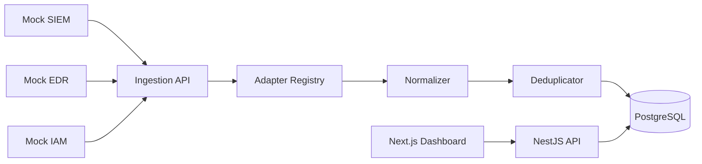

# SentinelView
## Security Event Monitoring Dashboard

SentinelView is a full-stack portfolio application that normalizes fictional SIEM, EDR, and IAM event payloads into a common security-event model for analyst review.

SentinelView is an educational portfolio project. All sources, payloads, detections, users, assets, and incidents are fictional. It is not a production SIEM, EDR, IAM, SOC, or threat-detection platform.

The repository does not reproduce proprietary employer integrations or commercial security-product schemas.

## What This Demonstrates

- Adapter-based ingestion for three fictional security sources
- Source-specific validation and normalization
- API-key protected ingestion
- Idempotent ingestion using `sourceType + sourceEventId`
- Analyst lifecycle: status, assignment, notes, and history
- PostgreSQL modeling with JSONB, indexes, constraints, and migrations
- REST APIs, Swagger, Docker, Jest, and a Next.js dashboard

## Architecture



## Event Sources

The supported sources are `MOCK_SIEM`, `MOCK_EDR`, and `MOCK_IAM`. Their payloads are invented for this project and are validated before normalization.

## Deduplication

Security events are unique by `sourceType + sourceEventId`. Duplicate ingestion increments `occurrenceCount`, updates `lastSeenAt`, preserves `firstSeenAt`, updates source metrics, and records a `DEDUPLICATED` history item.

## Security Model

Analyst APIs use JWT authentication and RBAC. Ingestion uses `X-Ingest-Key`; the key is read from `INGEST_API_KEY`, never stored in the frontend bundle, and never returned by the API. A production integration could use per-source keys, signed webhooks, mTLS, OAuth, or private networking.

## Setup

```bash
npm ci
cp .env.example .env
docker compose up -d postgres
npm run start:dev -w apps/api
npm run dev -w apps/web
```

Swagger is available at `http://localhost:3001/api/docs`.

## Demo Users

All seeded demo users use the password `Password123!`.

| Role | Email |
| --- | --- |
| ADMIN | `admin@sentinelview.local` |
| ANALYST | `analyst@sentinelview.local` |
| VIEWER | `viewer@sentinelview.local` |

## Demo Event Generator

```bash
npm run demo:events -- --source MOCK_SIEM --count 20
npm run demo:events -- --source MOCK_EDR --count 20
npm run demo:events -- --source MOCK_IAM --count 20
npm run demo:events -- --source MOCK_SIEM --count 20 --duplicates
```

The generator uses reserved documentation IP ranges only.

## Testing

```bash
npm run lint
npm run test
npm run build
```

## Docker

```bash
docker compose up --build -d
```

Services: `web`, `api`, and `postgres`. The API connects to PostgreSQL over the Compose service name `postgres`.

## Known Limitations

SentinelView intentionally uses fictional sources, a shared ingestion key, no real vendor API, no message queue, no OpenSearch, no correlation engine, no threat intelligence, no streaming, no multi-tenancy, no HA, and no long-term archive.

## Future Improvements

Documented future work includes per-source credentials, signed webhooks, mTLS, a message queue, OpenSearch, threat enrichment, a correlation engine, SSE/WebSockets, multi-tenancy, and workers.
